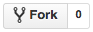
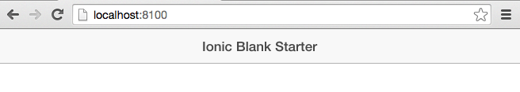

# Présentation de l'application "Citizen Engagement"

<a name="top"></a>

Ce répertoire permet de comprendre toutes les fonctionnalités de l'application mobile au travers de screenshot et d'explications.

* [Fonctionnalités](#features)

1. [Première étape: Les Mockups](#ui)
2. [Set up the application](#setup)
3. [Set up the navigation structure](#structure)
4. [Implémentation du login](#security)
  * [Création de la page login et logout](#security-login-screen)


<a name="features"></a>
## Fonctionnalités

Cette application permet aux utilisateurs de faires les choses suivantes:

* S'autentifier
* Voir les détails du profil utilisateur
* Ajouter un nouveau problème:
  * Le problème doit avoir un type, une description
  * Il doit pouvoir être localisé et donner la position géographique du problème
  * Il doit prendre une photo de celui-ci.
* Lister les problèmes existants
  * Les problèmes sont listés par ordre chronologique du plus récent au plus ancien.
* Voir les détails d'un problème
  * Date de création
  * Photo
  * Description
  * Auteur 
  * Etat
  * La position sur une carte
  * Les commentaires
* Ajouter des commentaires à un problème 

<a href="#top">Back to top</a>


<a name="ui"></a>
## 1. Conception de l'interface utilisateur

Avant de concevoir notre application, nous avons réalisé des mockups des pages utiles pour chacune de nos fonctionnalités afin de visualiser une structure de base et être clair sur le travail à fournir.

Pour le faire, nous avons utilisé [Fluid UI](https://www.fluidui.com).
<p>[Cliquez ici pour voir un aperçu de nos mockups](https://www.fluidui.com/editor/live/preview/p_onGAuhWggwgJk9UxFvpbrlUqWxlmfde8.1460667315369)</p>


Comme vous pouvez le voir, l'application a 6 interfaces différentes:

* La page login / inscription;
* La page des donnés de l'utilsateur;
* La page d'accueil avec un carte répertoriant les problèmes les plus proches de la position de l'utilisateur au moment de l'utilisation;
* La page de création d'un nouveau problème;
* La page d'un problème en particulier;
* La page de la liste de tous les problèmes ordrés du plus récent au plus vieux.

Une fois que nous avions terminés nos mockups, nous sommes passés à la réalisation.

<a href="#top">Back to top</a>


<a name="setup"></a>
## 2. Set up the application


<a name="setup-fork"></a>
### Fork this repo and put a blank Ionic app in it

[Fork](https://help.github.com/articles/fork-a-repo/) this repo by clicking on the following button at the top of the page:



**DO NOT** clone the repo on your machine yet.
Unfortunately, Ionic cannot generate a new application into an existing directory, so you'll have to generate the app first, then make it a Git repository.

Make sure you have Ionic and Cordova installed (you might need to use *sudo* if you are on Mac or Linux):

    npm install -g ionic cordova

Go in the directory where you want the app, then generate a blank Ionic app with the following command:

    ionic start citizen-engagement blank

Go into the app directory and make it a Git repository:

    cd citizen-engagement
    git init

If you type `git status` now, you should see all the files generated by Ionic for the blank app.
They should be marked as *untracked* by Git, since you haven't committed them yet.

Add your fork as the *origin* remote and pull all commits:

    git remote add origin git@github.com:<YOUR_GITHUB_USERNAME>/Teaching-HEIGVD-CM_APPMOB-2016-CitizenEngagement.git
    git pull origin master

Add and commit the files generated by Ionic, then push them to your fork:

    git add --all
    git commit -m "Blank Ionic app."
    git push origin master

<a href="#top">Back to top</a>


<a name="setup-deps"></a>
### Install application dependencies

Install development tools with:

    npm install

[npm](https://www.npmjs.com) reads the list of dependencies to install from `package.json`.

Make sure you have Bower installed (you might need to run this command with `sudo`):

    npm install -g bower

Install application libraries with:

    bower install

[Bower](http://bower.io) reads the list of libraries to install from `bower.json`.
As you can see in the `.bowerrc` configuration file, these libraries will be stored in the `www/lib` directory.

<a href="#top">Back to top</a>


<a name="setup-serve"></a>
### Serve the application locally

To make sure everything was set up correctly, use the following command from the repository to serve the application locally in your browser:

    ionic serve

You should see something like this:



<a href="#top">Back to top</a>


<a name="setup-rename"></a>
### Rename the main AngularJS module

As the application is a *starter application* generated by Ionic, the module is named `starter`.
Let's name it `citizen-engagement` instead.

Edit `www/js/app.js` and change the name:

```js
angular.module('citizen-engagement', ['ionic'])
```

Note the array used as second argument.
It is the list of the dependencies of the module.
You can see that the main module depends on the Ionic framework,
meaning that you will be able to use Ionic components in the application.

Also update the `ng-app` directive on the `<body>` tag in `www/index.html`, which references the module name:

```html
<body ng-app="citizen-engagement">
```

<a href="#top">Back to top</a>


<a name="structure"></a>
## 3. Set up the navigation structure

As defined in our UI design, we want the following 4 screens:

* the issue creation tab;
* the issue map tab;
* the issue list tab:
  * the issue details screen.

To have more than one screen, we need to set up routing.
[AngularUI Router](https://github.com/angular-ui/ui-router) is a routing framework integrated into Ionic which allows you to organize the parts of your interface into a *state machine*.
In this Ionic app, we will only use a subset of this routing functionality.
Basically we will define a state for each screen we want to display in the app.

<a href="#top">Back to top</a>


<a name="structure-create-templates"></a>
### Create the templates

Create the `www/templates` directory where we will put the screen templates:

    mkdir -p www/templates

To use tabs in the app, we will use the `<ion-tabs>` directive provided by Ionic ([ion-tabs documentation](http://ionicframework.com/docs/api/directive/ionTabs/)).
To define the 3 tabs, we actually need 4 templates: one template to define the list of tabs, and one template for the contents of each tab.

Let's create the `tabs.html` template in the directory we just created.
In here we will put the `<ion-tabs>` directive and define the 3 tabs (new issue, issue map and issue list):

```html
<ion-tabs class="tabs-icon-top tabs-color-active-positive">
  <ion-tab title="New Issue" icon-off="ion-plus-round" icon-on="ion-plus-round" href="#/tab/newIssue">
    <ion-nav-view name="tab-newIssue"></ion-nav-view>
  </ion-tab>
  <ion-tab title="Issue Map" icon-off="ion-map" icon-on="ion-map" href="#/tab/issueMap">
    <ion-nav-view name="tab-issueMap"></ion-nav-view>
  </ion-tab>
  <ion-tab title="Issue List" icon-off="ion-navicon-round" icon-on="ion-navicon-round" href="#/tab/issueList">
    <ion-nav-view name="tab-issueList"></ion-nav-view>
  </ion-tab>
</ion-tabs>
```

Create another 3 templates, one for each tab: `newIssue.html`, `issueMap.html` and `issueList.html`.
Finaly, also create the issue details template, `issueDetails.html`.
For now, let's just put a simple title and message in each template so we know we're on the right screen.
The contents of each should be something like this:

```html
<ion-view view-title="New Issue">
  <ion-content>
    <p>Hello! This is the issue creation screen.</p>
  </ion-content>
</ion-view>
```

Your `www/templates` directory should now contain 4 files:

    newIssue.html
    issueDetails.html
    issueList.html
    issueMap.html
    tabs.html

<a href="#top">Back to top</a>


<a name="structure-use-templates"></a>
### Update the app to use the templates

Now that the templates are ready, Ionic needs to know where to display them.
You can do this by adding an `<ion-nav-view>` tag in the `index.html` page.
This is where the contents of each template will be inserted depending on the current state (or route).

We also need a navigation bar at the top of the screen to display the title of the current screen.
This bar should always be there so we don't have to define it in each template:
Ionic provides with the `<ion-nav-bar>` tag for this purpose.

Update the `<body>` of the `index.html` page to look like this:

```html
<body ng-app="citizen-engagement">

  <!--
    The nav bar that will be updated as we navigate between views.
  -->
  <ion-nav-bar class="bar-stable">
    <ion-nav-back-button>
    </ion-nav-back-button>
  </ion-nav-bar>

  <!--
    The views will be rendered in the <ion-nav-view> directive below
    Templates are in the /templates folder (but you could also
    have templates inline in this html file if you'd like).
  -->
  <ion-nav-view></ion-nav-view>
</body>
```

<a href="#top">Back to top</a>


<a name="structure-states"></a>
### Define the states (or routes)

Simply creating the templates isn't enough.
You need to configure AngularUI Router to define the states (or routes) for all screens.

Just as we have 5 templates (one for each screen plus one to define the tabs), we will need 5 states.
One of these states, the one containing the template to define the tabs, will be an abstract one (meaning it's not an actual screen the user can go to, but it's needed for navigation).

Routing states are configured in `www/app.js`.
You can add this `.config` block after the existing `.run` block at the end of the file:

```js
.config(function($stateProvider, $urlRouterProvider) {

  // Ionic uses AngularUI Router which uses the concept of states
  // Learn more here: https://github.com/angular-ui/ui-router
  // Set up the various states which the app can be in.
  // Each state's controller can be found in controllers.js
  $stateProvider

    // This is the abstract state for the tabs directive.
    .state('tab', {
      url: '/tab',
      abstract: true,
      templateUrl: 'templates/tabs.html'
    })

    // The three next states are for each of the three tabs.
    // The state names start with "tab.", indicating that they are children of the "tab" state.
    .state('tab.newIssue', {
      // The URL (here "/newIssue") is used only internally with Ionic; you never see it displayed anywhere.
      // In an Angular website, it would be the URL you need to go to with your browser to enter this state.
      url: '/newIssue',
      views: {
        // The "tab-newIssue" view corresponds to the <ion-nav-view name="tab-newIssue"> directive used in the tabs.html template.
        'tab-newIssue': {
          // This defines the template that will be inserted into the directive.
          templateUrl: 'templates/newIssue.html'
        }
      }
    })

    .state('tab.issueMap', {
      url: '/issueMap',
      views: {
        'tab-issueMap': {
          templateUrl: 'templates/issueMap.html'
        }
      }
    })

    .state('tab.issueList', {
      url: '/issueList',
      views: {
        'tab-issueList': {
          templateUrl: 'templates/issueList.html'
        }
      }
    })

    // This is the issue details state.
    .state('tab.issueDetails', {
      // We use a parameterized route for this state.
      // That way we'll know which issue to display the details of.
      url: '/issueDetails/:issueId',
      views: {
        // Here we use the same "tab-issueList" view as the previous state.
        // This means that the issue details template will be displayed in the same tab as the issue list.
        'tab-issueList': {
          templateUrl: 'templates/issueDetails.html'
        }
      }
    })
  ;

  // Define the default state (i.e. the first screen displayed when the app opens).
  $urlRouterProvider.otherwise(function($injector) {
    $injector.get('$state').go('tab.newIssue'); // Go to the new issue tab by default.
  });
})
```

<a href="#top">Back to top</a>


<a name="security"></a>
## 4. Set up security

To use the app, a citizen should identify him- or herself.
You will add a login screen that the user must go through before accessing the other screens.

You will use the API you previously implemented to actually log in.
If you do not have a running API, you may also use the [reference implementation](https://polar-brook-7624.herokuapp.com/api/).

The reference implementation identifies users with a user ID.
This ID must be sent in the `X-User-Id` header for all requests requiring identification.

<a href="#top">Back to top</a>


<a name="security-login-screen"></a>
### Create the login screen

Let's start by creating a login screen.
Add a `login.html` template in `www/templates`:

```html
<ion-view view-title="Citizen Engagement">
  <ion-content class="padding">

    <!-- A banner. Choose an image and save it as www/img/banner.jpg -->
    

    <!-- A short welcome message. -->
    <div class="card">
      <div class="item item-text-wrap">
        Welcome to Citizen Engagement!
        Please register to use the application.
      </div>
    </div>

    <!-- The login form that the citizen must fill. -->
    <form name="loginForm">

      <!-- Ionic uses lists to group related input elements. -->
      <div class="list">
        <label class="item item-input">
          <!-- Note the required="required" attribute used for validation. -->
          <input type="text" placeholder="First Name" ng-model="user.firstname" required="required"/>
        </label>
        <label class="item item-input">
          <input type="text" placeholder="Last Name" ng-model="user.lastname" required="required"/>
        </label>
      </div>

      <!-- Display an error message here, above the submit button, if an error occurred. -->
      <p ng-if="error" class="error">{{ error }}</p>

      <!--
        The submit button.
        The "ng-click" directive indicates which scope function to call when the form is submitted.
        The "ng-disabled" directive is used to disable the button if the form is invalid (i.e. the first name or last name is missing).
      -->
      <button class="button button-full button-positive" ng-click="register()" ng-disabled="loginForm.$invalid">Register</button>
    </form>
  </ion-content>
</ion-view>
```

This proposed login template has an image banner.
Don't forget to choose an image and save it as `www/img/banner.jpg`.

Define the state for the login screen in `www/js/app.js`

```js
.state('login', {
  url: '/login',
  templateUrl: 'templates/login.html'
})
```

<a href="#top">Back to top</a>


<a name="security-auth-service"></a>
### Create the authentication service

Now that we have our login screen, we must configure the app to redirect the user to it if he hasn't yet logged in.
To do that, we need a way to tell whether the user has logged in or not.
This will be our first AngularJS service: the authentication service.

Create a new `www/js/auth.js` file containing this:

```js
angular.module('citizen-engagement.auth', [])

  .factory('AuthService', function() {

    var service = {
      currentUserId: null,

      setUser: function(user) {
        service.currentUserId = user.userId;
      },

      unsetUser: function() {
        service.currentUserId = null;
      }
    };

    return service;
  })

;
```

This file defines a new module, `citizen-engagement.auth`, where we will put all authentication-related functionality.
For now, the module only defines one service, `AuthService`, which manages the current user with the `currentUserId` property.
If this property has a value, the user is logged in; otherwise, he isn't.

To use this new module, you must add it to `www/index.html` like this:

```html
  <head>
    <!-- ... meta, link, etc ... -->

    <!-- your app's js -->
    <script src="js/app.js"></script> <!-- The existing module for the whole application. -->
    <script src="js/auth.js"></script> <!-- Your new module. -->
  </head>
```

You must also add it as a dependency of your AngularJS application in `www/js/app.js`:

```js
angular.module('citizen-engagement', ['ionic', 'citizen-engagement.auth'])
```

We will implement the rest of this service later.
First, let's make sure the app shows the login screen.
Edit `www/js/app.js` and add this `run` block:

```js
.run(function(AuthService, $rootScope, $state) {

  // Listen for the $stateChangeStart event of AngularUI Router.
  // This event indicates that we are transitioning to a new state.
  // We have the possibility to cancel the transition in the callback function.
  $rootScope.$on('$stateChangeStart', function(event, toState) {

    // If the user is not logged in and is trying to access another state than "login"...
    if (!AuthService.currentUserId && toState.name != 'login') {

      // ... then cancel the transition and go to the "login" state instead.
      event.preventDefault();
      $state.go('login');
    }
  });
})
```

The login screen is ready!
If you reload your app, you should see that you are automatically redirected to the login page.
You also can't go to any other screen any more, since we haven't implemented the actual login yet.

<a href="#top">Back to top</a>


<a name="security-proxy"></a>
### Set up a proxy (for local development only)

If you are serving your Ionic app locally with `ionic serve`,
**beware of the [same-origin policy](http://en.wikipedia.org/wiki/Same-origin_policy)!**

In a web application, the browser will only allow remote calls to the same **origin**.
Your Ionic app is essentially a web page, served at `http://localhost:8100`.
If your API lives at `https://api.example.com`, you won't be able to call it from your Ionic app because the browser will block the call.

To work around this issue, add the following `proxies` configuration to your `ionic.project` file:

```
{
  "name": "citizen-engagement",
  "app_id": "",
  "proxies": [
    {
      "path": "/api-proxy",
      "proxyUrl": "https://<YOUR_API_HOST>/api"
    }
  ]
}
```

This will proxy calls to your API if your URL path starts with `/api-proxy`.
For example, if you call `http://localhost:8100/api-proxy/users` from your application, it will actually call `https://<YOUR_API_HOST>/api/users`.

**You must** terminate `ionic serve` and re-launch it to take this configuration into account.

<a href="#top">Back to top</a>


<a name="security-api-login"></a>
### Log in with the API

You will now integrate with the API!

In the proposed implementation, we will use the `/users/logister` action [described in the reference implementation](https://polar-brook-7624.herokuapp.com/api/reference/#users).
This action either returns an existing user or creates it if it doesn't exist.

We need to make the following call:

```json
POST /api/users/logister HTTP/1.1
Content-Type: application/json

{
  "firstname": "Alain",
  "lastname": "Terieur",
}
```

The response will contain the user ID we need for authentication:

```json
HTTP/1.1 200 OK
Content-Type: application/json

{
  "userId": "54d8ae163fd30364605c81a4",
}
```

You must make this call when the user clicks on the "Register" button of the login template.
As you can see in the proposed login template you added earlier, the submit button already has an `ng-click` directive.

```html
<button class="button button-full button-positive" ng-click="register()" ng-disabled="loginForm.$invalid">Register</button>
```

The directive defines what happens when the button is clicked.
In this case, it calls the `register()` function.

To react to view events, we need an AngularJS **controller**.
In the controller, you will be able to add the `register()` function to the scope.

Let's add it to `www/js/auth.js` after the service:

```js
  .controller('LoginCtrl', function(AuthService, $http, $ionicHistory, $ionicLoading, $scope, $state) {

    // The $ionicView.beforeEnter event happens every time the screen is displayed.
    $scope.$on('$ionicView.beforeEnter', function() {
      // Re-initialize the user object every time the screen is displayed.
      // The first name and last name will be automatically filled from the form thanks to AngularJS's two-way binding.
      $scope.user = {};
    });

    // Add the register function to the scope.
    $scope.register = function() {

      // Forget the previous error (if any).
      delete $scope.error;

      // Show a loading message if the request takes too long.
      $ionicLoading.show({
        template: 'Logging in...',
        delay: 750
      });

      // Make the request to retrieve or create the user.
      $http({
        method: 'POST',
        url: 'http://localhost:8100/api-proxy/users/logister',
        data: $scope.user
      }).success(function(user) {

        // If successful, give the user to the authentication service.
        AuthService.setUser(user);

        // Hide the loading message.
        $ionicLoading.hide();

        // Set the next view as the root of the history.
        // Otherwise, the next screen will have a "back" arrow pointing back to the login screen.
        $ionicHistory.nextViewOptions({
          disableBack: true,
          historyRoot: true
        });

        // Go to the issue creation tab.
        $state.go('tab.newIssue');

      }).error(function() {

        // If an error occurs, hide the loading message and show an error message.
        $ionicLoading.hide();
        $scope.error = 'Could not log in.';
      });
    };
  })
```

Take a moment to read the comments in the controller's code.

Simply defining the controller isn't enough.
You must also update the login state to use it (in `www/js/app.js`):

```js
    .state('login', {
      url: '/login',
      controller: 'LoginCtrl',
      templateUrl: 'templates/login.html'
    })
```

If your API works, you should now be able to log in!

<a href="#top">Back to top</a>


<a name="security-logout"></a>
### Log out

You should also allow the user to log out.

Let's add another controller to `www/js/auth.js`:

```js
  .controller('LogoutCtrl', function(AuthService, $scope, $state) {
    $scope.logOut = function() {
      AuthService.unsetUser();
      $state.go('login');
    };
  })
```

And add the logout button.
You can add override any screen's navigation buttons using Ionic's `<ion-nav-buttons>` directive.

For example, you can update your issue creation template (`www/templates/newIssue.html`) to look like this:

```html
<ion-view view-title="New Issue">
  <ion-nav-buttons side="secondary">
    <button type="button" ng-controller="LogoutCtrl" ng-click="logOut()" class="button">Log Out</button>
  </ion-nav-buttons>
  <ion-content>
    <p>Hello! This is the issue creation screen.</p>
  </ion-content>
</ion-view>
```

You should now see the logout button in the navigation bar after logging in.
You may also add the logout button to the other two tabs if you want.

<a href="#top">Back to top</a>


<a name="security-store"></a>
### Storing the authentication credentials

Now you can log in and log out, but there's a little problem.
Every time the app is reloaded, you lose all data so you have to log back in.
This is particularly annoying for local development since the browser is automatically refreshed every time you change the code.

You need to use more persistent storage for the security credentials, i.e. the user ID.
Since an Ionic app is a web app, the simplest is to use [Web Storage](http://en.wikipedia.org/wiki/Web_storage),
or more specifically [Local Storage](http://diveintohtml5.info/storage.html).

Starting with HTML 5, you have access to the `localStorage` variable from your Javascript code.
You may store any key/value pair in local storage.
It will persist even after you navigate away to another page or close the page.

```js
localStorage.foo = "bar";
console.log(localStorage.foo); // => "bar"
```

However, you **should not** use it directly like this in an AngularJS application; that is not the Angular way.
In an Angular application, you should always wrap such functionality in a service.
This encourages each service to do only one thing and to do it well.
It also makes it easier to unit test the service.

Instead of writing a service yourself, you should always check if someone has already done it for you.
In this case, we propose to use the [auth0/angular-storage](https://github.com/auth0/angular-storage) library which is a nice AngularJS wrapper around the native local storage functionality.

As shown in their documentation, it can be installed with Bower.
Since your Ionic app already uses Bower by default, it's trivial to add the Bower dependency:

```bash
bower install --save "a0-angular-storage#0.0.13"
```

**Note:** at the time of writing these instructions,
the latest version of the library (v0.0.14) has a [dependency bug](https://github.com/auth0/angular-storage/issues/53),
which is why we're specifically installing the previous version (v0.0.13).

If you look in `www/lib`, you should see a new `a0-angular-storage` directory.

As with all Javascript files, you must add it to `www/index.html` to use it.
You should add it next to the existing Ionic script tag:

```html
  <head>
    <!-- ... meta, link, etc ... -->

    <!-- ionic/angularjs js -->
    <script src="lib/ionic/js/ionic.bundle.js"></script> <!-- The existing Ionic dependency. -->
    <script src="lib/a0-angular-storage/dist/angular-storage.js"></script> <!-- The new dependency. -->

    <!-- ... more scripts ... -->
  </head>
```

And as with all AngularJS modules, you must add it as a dependency.
In this case, the authentication module needs it, so you should add the dependency in `www/js/auth.js`:

```js
angular.module('citizen-engagement.auth', ['angular-storage'])
```

You can now update the `AuthService` in the same file to use persistent storage:

```js
  .service('AuthService', function(store) {

    var service = {
      currentUserId: store.get('currentUserId'),

      setUser: function(user) {
        service.currentUserId = user.userId;
        store.set('currentUserId', user.userId);
      },

      unsetUser: function() {
        service.currentUserId = null;
        store.remove('currentUserId');
      }
    };

    return service;
  })
```

Your app should now remember user credentials even when you reload it!

<a href="#top">Back to top</a>


<a name="security-interceptor"></a>
### Configuring an HTTP interceptor

Now that you have login and logout functionality, and an authentication service that can give you the current user ID, you can identify the user for other API calls.
Taking an example from the reference implementation, you could [retrieve the list of issues](https://polar-brook-7624.herokuapp.com/api/reference/#issues).
The documentation states that we must send a user ID in the `X-User-Id` header, like this:

```
GET /api/issues HTTP/1.1
X-User-Id: aow38nuviabetz78b8s
```

With AngularJS, you would make this call like this:

```js
.controller('AnyCtrl', function(AuthService, $http) {
  $http({
    url: 'http://localhost:8100/api-proxy/issues',
    headers: {
      'X-User-Id': AuthService.currentUserId
    }
  }).success(function(data) {
    // ...
  });
})
```

But it's a bit annoying to have to specify this header for every request.
After all, we know that we need it for most, if not all calls.

[**Interceptors**](http://www.webdeveasy.com/interceptors-in-angularjs-and-useful-examples/) are Angular services that can be registered with the `$http` service to automatically modify all requests (or responses).
This solves our problem: we want to register an interceptor that will automatically add the `X-User-Id` header to all requests if the user is logged in.

First, let's create the interceptor service.
Since it's authentication-related, let's add it to `www/js/auth.js`:

```js
  .factory('AuthInterceptor', function(AuthService) {
    return {

      // The request function will be called before all requests.
      // In it, you can modify the request configuration object.
      request: function(config) {

        // If the user is logged in, add the X-User-Id header.
        if (AuthService.currentUserId) {
          config.headers['X-User-Id'] = AuthService.currentUserId;
        }

        return config;
      }
    };
  })
```

Now you simply need to register the interceptor with the provider of the `$http` service.
In the same file, add:

```js
  .config(function($httpProvider) {
    $httpProvider.interceptors.push('AuthInterceptor');
  })
```

Now all your API calls will have this header when the user is logged in.

<a href="#top">Back to top</a>


<a name="multienv"></a>
## 5. Multi-environment configuration

A problem you will quickly encounter with Ionic is multiple environments.
You want to be able to:

* serve the app locally;
* run the app on a connected device.

In the first case, as you've seen, you need to set up a proxy to work around the same-origin policy.
But when you run the app on a device, Cordova sets things up so you don't have to do that, and you can't use the proxy.

This means that you need to change your URLs depending on which **environment** you're running the app in:

* when serving the app locally, use `http://localhost:8100/api-proxy`;
* when running the app on a device, use `https://<YOUR_API_HOST>/api`.

In the [login implementation you did earlier](#security-api-login), the URL was hardcoded:

```js
      $http({
        method: 'POST',
        url: 'http://localhost:8100/api-proxy/users/logister',
        data: $scope.user
      })
```

This is very bad considering the multi-environment problem.
You would have to manually change the URL every time you change environments.
Even if you set up a global variable so you only have to do it in once place, think what will happen when you start integrating with other APIs or services.
You will have that many settings to change every time.

Let's find a way to automate this process.

<a href="#top">Back to top</a>


<a name="multienv-config"></a>
### Write environment-specific configuration files

A pattern used in many frameworks is to have a configuration file for each environment.
Since we only have the URL of the API for now, the configuration would look like this:

```json
{
  "apiUrl": "https://<API_HOST>/api"
}
```

Let's set this up now.
Create a `config` directory at the root of your application.

Add `development.json` in that directory.
This file contains the configuration for the **development environment**, when you develop the app locally:

```json
{
  "apiUrl": "http://localhost:8100/api-proxy"
}
```

Now add `production.json` in the same directory.
This file contains the configuration for the **production environment**, meaning when you run the app on a device:

```json
{
  "apiUrl": "https://<YOUR_API_HOST>/api"
}
```

<a href="#top">Back to top</a>


<a name="multienv-ignore"></a>
### Do not put configuration files under version control

Another good practice is to **NOT put your configuration files under version control**, especially if your Git repository is public.
API endpoints should not be exposed for everyone to see.
You might also store credentials for other APIs and services in the configuration files.
You definitely don't want those exposed.

Add the following line to your `.gitignore` file at the root of the repository:

```
config/*
```

Now there's just a little problem: if you clone this repository on another machine, you won't have any configuration file.
This is good because you don't want anyone who clones the repository to obtain configuration that should remain secret.
But maybe you forgot what goes into the configuration file.

That is why you should always provide a sample configuration file.
Add `sample.json` to the `config` directory:

```json
{
  "apiUrl": "https://example.com/api"
}
```

Also add this line to the `.gitignore` file, **below the other line you added**:

```
!config/sample.json
```

This is an exception to the previous rule.
It tells Git to keep the `sample.json` file even though you're ignoring everything else in the directory.

<a href="#top">Back to top</a>


<a name="multienv-angular"></a>
### Feed the configuration to Angular

Now that you have your environment-specific configuration files, you want to be able to use this configuration in Angular controllers and services.
You don't have direct access to those files from the Angular application.
You need to convert the JSON file for the correct environment into something Angular can use.

This kind of configuration is usually found in Angular constants:

```js
  .constant('apiUrl', 'https://example.com/api')
```

Of course, you can't just use a hardcoded URL like this.
Let's create a new `constants.js` module to hold these constants.
Unlike other modules that are in `www/js`, you should create this one at the root of the repository (at the same level as `www`):

```js
angular.module('citizen-engagement.constants', [])
  .constant('apiUrl', '@apiUrl@')
;
```

As you can see, there's no URL here; it's only a placeholder.
We'll use [Gulp](http://gulpjs.com), the automation tool bundled with Ionic, to insert the actual configuration values.
Gulp allows you to define custom tasks for your project; for example, you could define a task to compress your Javascript files.
In this case, you're going to define a task to inject the configuration into the constants template, and save the result where your app can use it.

Install the `gulp-replace` dependency that can do the replacing for us:

```
npm install --save gulp-replace
```

Include it at the top of `gulpfile.js`:

```js
var replace = require('gulp-replace');
```

Now add the task (still in `gulpfile.js`):

```js
function saveConfig(environment) {

  var config = require('./config/' + environment + '.json');

  // Use `constants.js` as the source.
  gulp.src(['constants.js'])

    // Replace all occurrences of @apiUrl@.
    .pipe(replace(/@apiUrl@/g, config.apiUrl))

    // Save the result in www/js.
    .pipe(gulp.dest('www/js'));
}

gulp.task('config-development', function(){
  saveConfig('development');
});

gulp.task('config-production', function(){
  saveConfig('production');
});
```

Now, when you want to switch environments, just run `gulp config-development` or `gulp config-production` from your terminal, and the Angular constants in `www/js/constants.js` will be updated.

**You must also add this file to `.gitignore`**, or all this work to avoid exposing configuration values will have been for nothing:

```
www/js/constants.js
```

All that remains is to use the constants in your app.

Since this is a new module, you must add it to `www/index.html`:

```html
  <head>
    <!-- ... meta, link, etc ... -->

    <!-- your app's js -->
    <script src="js/app.js"></script>
    <script src="js/auth.js"></script>
    <script src="js/constants.js"></script>
  </head>
```

Also add it as a dependency of your app (in `www/js/app.js`):

```js
angular.module('citizen-engagement', ['ionic', 'citizen-engagement.auth', 'citizen-engagement.constants'])
```

You can now inject `apiUrl` anywhere you want.
Let's add it to the injections of `LoginCtrl` (in `www/js/auth.js`):

```js
.controller('LoginCtrl', function(apiUrl, AuthService, $http, $ionicHistory, $ionicLoading, $scope, $state) {
```

Now update the API call to use `apiUrl` (same file):

```js
$http({
  method: 'POST',
  url: apiUrl + '/users/logister',
  data: $scope.user
})
```

Finally!
Your configuration is now hidden from public view and properly injected into the app.

<a href="#top">Back to top</a>
