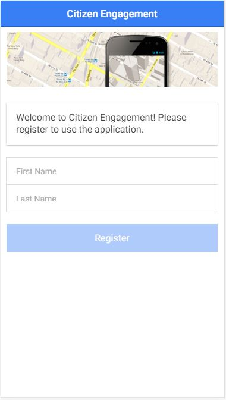
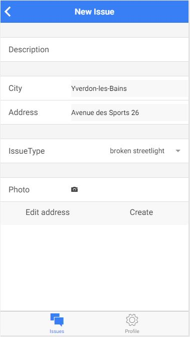

# Présentation de l'application "Citizen Engagement"

+----------------+
Application mobile réalisée dans le cadre du cours "AppMobile" de Comem+ à l'heig-vd.
Étudiants: Valérie Stauffer et Emmanuel Schenk
+----------------------------------------------------------------------------------+

Ce répertoire explique le fonctionnement général de l'application "Citizen Engagement". Celle-ci permet d'identifier des problèmes dans une ville et de les répertorier dans une base de donnée grâce à l'application. Ces problèmes sont décrits avec une photo, du texte, une position sur une carte ainsi qu'un status pour dire si le problème est résolu ou est encore à faire. 

1. [Liste des fonctionnalités](#features)
2. [Conception de l'interface utilisateur](#ui)
3. [Page de connexion](#login)
4. [Page d'un utilisateur et déconnexion](#profil)
5. [Page d'accueil](#mainPage)
6. [Page d'un nouveau problème](#newIssue)
7. [Page de la liste des problèmes](#listofIssues)
8. [Page d'un problème](#detailsofIssue)

## 1. Liste des fonctionnalités

Cette application permet aux utilisateurs de faires les choses suivantes:

* [S'authentifier](#login)
* [Voir les détails du profil utilisateur](#profil)
* [Ajouter un nouveau problème](#newIssue):
  * Le problème doit avoir un type, une description
  * Il doit pouvoir être localisé et donner la position géographique du problème
  * Il doit prendre une photo de celui-ci.
* [Lister les problèmes existants] (#listofIssues)
  * Les problèmes sont listés par ordre chronologique du plus récent au plus ancien.
* [Voir les détails d'un problème](#detailsofIssue)
  * Date de création
  * Photo
  * Description
  * Auteur 
  * Etat
  * La position sur une carte
  * Les commentaires
* [Ajouter des commentaires à un problème](#detailsofIssue) 

<a href="#top">Haut de la page</a>

## 2. Conception de l'interface utilisateur

Avant de concevoir notre application, nous avons réalisé des mockups des pages utiles pour chacune de nos fonctionnalités afin de visualiser une structure de base et être clair sur le travail à fournir.

Pour le faire, nous avons utilisé [Fluid UI](https://www.fluidui.com).

[Cliquez ici pour voir un aperçu de nos mockups](https://www.fluidui.com/editor/live/preview/p_onGAuhWggwgJk9UxFvpbrlUqWxlmfde8.1460667315369)

Comme vous pouvez le voir, l'application a 6 interfaces différentes:

* La page login / inscription;
* La page des donnés de l'utilsateur;
* La page d'accueil avec un carte répertoriant les problèmes les plus proches de la position de l'utilisateur au moment de l'utilisation;
* La page de création d'un nouveau problème;
* La page de la liste de tous les problèmes ordrés du plus récent au plus vieux;
* La page d'un problème en particulier.

Une fois que nous avions terminés nos mockups, nous sommes passés à la réalisation.

<a href="#top">Haut de la page</a>

## 3. Page de connexion

Pour pouvoir utiliser les fonctionnalités de l'application, l'utilisateur doit commencer par s'enregistrer ou se loguer par son nom et son prénom. Tant qu'il n'a pas complété les deux champs, le bouton reste pas cliquable. 

<a href="#top">Haut de la page</a>

## 4. Page d'un utilisateur et déconnexion

L'utilisateur peut à tout moment voir ses coordonnées depuis l'onglet "profil" facilement accessible en bas de l'interface. C'est dans cette page que l'utilisateur pourra se déconnecter, ce qui le ramènera directement à la page de login. 

<a href="#top">Haut de la page</a>

## 5. Page d'accueil

Une fois connecté, l'utilisateur arrivera sur la page d'accueil. Cette page donne l'emplacement de l'utilisateur, ainsi que tous les problèmes répertoriés dans un rayon prédéfini. Si l'utilisateur clique sur un des marqueurs, une bulle s'ouvre avec la description et la photo du problème.

Sur cette page d'accueil, il y a des onglets en haut et en bas. En haut, de gauche à droite, se trouve le lien pour aller voir la liste des problèmes, puis la possibilité de créer un problème. En bas, se trouve l'onglet "issues" qui permet de revenir chaque fois à la page d'accueil et "profil" qui donne les coordonnées de l'utilisateur. 

<a href="#top">Haut de la page</a>

## 6. Page d'un nouveau problème

Lorsque l'on veut créer un nouveau problème, il faut dans un premier temps donner une description du problème. L'adresse est complétée directement avec la position de l'utilisateur. S'il le désire, il peut éditer l'adresse du problème grâce à l'onglet "Edit address" qui le dirige sur une carte où il peut placer le marqueur à l'adresse qu'il veut. Revenu sur la page, il faut sélectionner le type du problème pour le catégoriser, et prendre une photo de celui-ci. C'est en cliquant sur "create" que le problème sera enregistré dans la base de donnée.

<a href="#top">Haut de la page</a>

## 7. Page de la liste des problèmes

Cette page répertorie tous les problèmes par ordre chronologique, du plus récent ou plus vieux. Une barre de recherche permet de trouver le/les problèmes selon le texte de la description. 

Chaque bloc est composé de la photo, du type, du status et de la description du problème. En cliquant sur un des blocs, l'utilisateur est dirigé sur la page détaillé de ce problème. 

<a href="#top">Haut de la page</a>

## 8. Page d'un problème

Ici, l'utilisateur trouve les détails du problème sélectionné. Il y a le type du problème, ainsi que la date où le problème a été actualisé, c'est-à-dire lorsque son status a été changé. Ensuite, il y a sa photo, sa description, l'auteur qui l'a créé, son status et la possibilité de voir sa position sur la carte. 

Dessous, c'est la partie des commentaires. L'utilisateur peut rajouter autant de commentaires qu'il le veut concernant ce problème. La liste de tous les commentaires est visible après l'ajout de commentaires. 

 

<a href="#top">Haut de la page</a>

